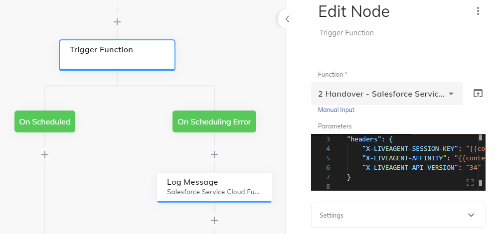
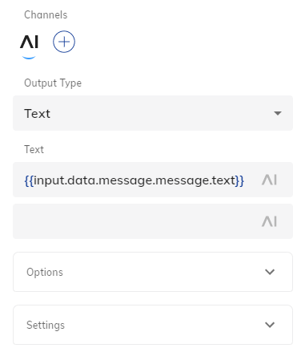

# Salesforce Service Cloud

This function is used within the **Salesforce Service Cloud** integration and should be used together with the related [Salesforce Extension](https://github.com/Cognigy/Extensions/tree/master/extensions/salesforce-service-cloud).

- [Documentation](https://support.cognigy.com/hc/en-us/articles/360020749080-Salesforce-Service-Cloud-Integrate-Live-Chat-Handover)

## Example Execution

Within a Flow, the [Trigger Function](https://docs.cognigy.com/docs/cognigy-functions-1#triggering-a-function) Node can be used.



Inside **Parameters** JSON field, additional information can be provided:

```json
{
    "liveAgentUrl": "https://d.la1-c1-cdg.salesforceliveagent.com/chat/rest",
    "headers": {
        "X-LIVEAGENT-SESSION-KEY": "{{context.liveChat.session.key}}",
        "X-LIVEAGENT-AFFINITY": "{{context.liveChat.session.affinityToken}}",
        "X-LIVEAGENT-API-VERSION": "34"
    }
}
```

As soon as the function instance is running, three different events will be injected to the chat conversation (Flow):

1. ChatEnded
2. ChatEstabblished
3. ChatMessage

They can be used, e.g. inside of a Lookup Node, by using CognigyScript: `{{input.data.message.type}}`. In the case of the ChatMessage, one can simply use a Say Node in order to output the Agent's text message to the user:



Text: `{{input.data.message.message.text}}`
