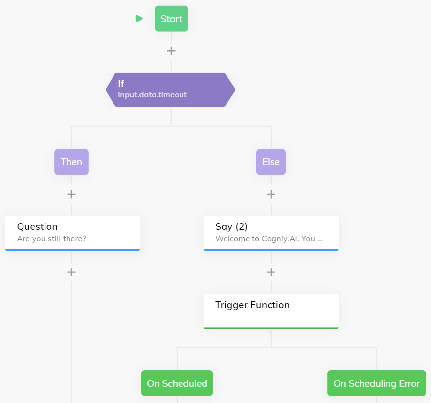

# User Timeout

This function provides a simple example for handling user timeouts. In a conversation it could come to the case that the user does not respond for a longer time while the conversation should end or something similar. A function can be used in order to **start a timer** and inform the Flow about the absent user.

## Example Execution

Within a Flow, the [Trigger Function](https://docs.cognigy.com/docs/cognigy-functions-1#triggering-a-function) Node can be used.



Inside **Parameters** JSON field, the actual time to wait can be provided as `milliseconds`:

```json
{
    "milliseconds": 60000,
}
```

The function will return a `timeout` value that can be checked with an If Node: 

`input.data.timeout`
